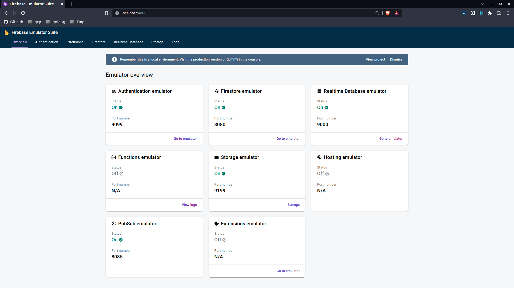

# 1. firebase-emulator-docker

Running Firebase emulator with docker.

- Cloud Firestore
- Pub/Sub
- Realtime Database
- Authentication
- Cloud Storage

## 1.1. Getting Started

### 1.1.1. How to run

```bash
# build by default tag
$ make build

# run by default
$ make run
# ...
# ┌─────────────────────────────────────────────────────────────┐
# │ ✔  All emulators ready! It is now safe to connect your app. │
# │ i  View Emulator UI at http://0.0.0.0:4000                  │
# └─────────────────────────────────────────────────────────────┘

# ┌────────────────┬──────────────┬───────────────────────────────┐
# │ Emulator       │ Host:Port    │ View in Emulator UI           │
# ├────────────────┼──────────────┼───────────────────────────────┤
# │ Authentication │ 0.0.0.0:9099 │ http://0.0.0.0:4000/auth      │
# ├────────────────┼──────────────┼───────────────────────────────┤
# │ Firestore      │ 0.0.0.0:8080 │ http://0.0.0.0:4000/firestore │
# ├────────────────┼──────────────┼───────────────────────────────┤
# │ Database       │ 0.0.0.0:9000 │ http://0.0.0.0:4000/database  │
# ├────────────────┼──────────────┼───────────────────────────────┤
# │ Pub/Sub        │ 0.0.0.0:8085 │ n/a                           │
# ├────────────────┼──────────────┼───────────────────────────────┤
# │ Storage        │ 0.0.0.0:9199 │ http://0.0.0.0:4000/storage   │
# └────────────────┴──────────────┴───────────────────────────────┘
# ...
```

If run by default, you can view Emulator UI in your browser at `localhost:4000`.



### 1.1.2. Port configuration

| Emulator          | Default Port |
| :---------------- | :----------: |
| Emulator Suite UI |     4000     |
| Cloud Firestore   |     8080     |
| Pub/Sub           |     8085     |
| Realtime Database |     9000     |
| Authentication    |     9099     |
| Cloud Storage     |     9199     |

### 1.1.3. Custom Running

#### 1.1.3.1. Changing project

1. Set `PROJECT` environment when runnning docker

```bash
# Example
$ docker run --rm \
    -e PROJECT=my-project \
    -p 4000:4000 \
    -p 8080:8080 \
    -p 8085:8085 \
    -p 9000:9000 \
    -p 9099:9099 \
    -p 9199:9199 \
    $(DOCKER_TAG)
```

#### 1.1.3.2. Changing emulators and ports

1. Create custom firebase.json
2. Mount custom firebase.json and specify ports when running docker

```bash
# Example

# Create custom firebase.json
$ cat << EOF > my_firebase.json
{
  "emulators": {
    "ui": {
      "enabled": true,
      "host": "0.0.0.0",
      "port": 4000
    },
    "firestore": {
      "host": "0.0.0.0",
      "port": 8080
    }
  }
}
EOF

# Mount custom firebase.json and specify ports when running docker
$ docker run --rm \
    -v $(pwd)/my_firebase.json:/usr/firebase/firebase.json \
    -p 4000:4000 \
    -p 8080:8080 \
    $(DOCKER_TAG)
# ...
# ┌─────────────────────────────────────────────────────────────┐
# │ ✔  All emulators ready! It is now safe to connect your app. │
# │ i  View Emulator UI at http://0.0.0.0:4000                  │
# └─────────────────────────────────────────────────────────────┘

# ┌───────────┬──────────────┬───────────────────────────────┐
# │ Emulator  │ Host:Port    │ View in Emulator UI           │
# ├───────────┼──────────────┼───────────────────────────────┤
# │ Firestore │ 0.0.0.0:8080 │ http://0.0.0.0:4000/firestore │
# └───────────┴──────────────┴───────────────────────────────┘
# ...
```

#### 1.1.3.3. Changing Cloud Storage Emulator's rules

1. Create custom storage.rules
2. Mount custom storage.rules when running docker

[docker]: https://docs.docker.com/get-docker/